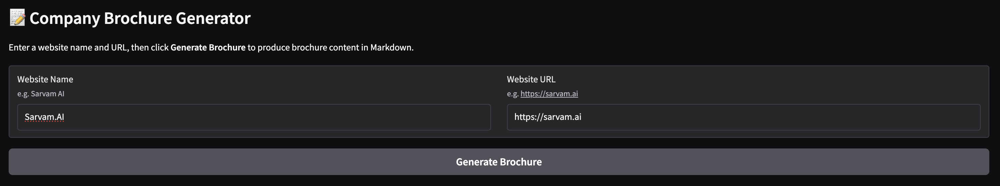
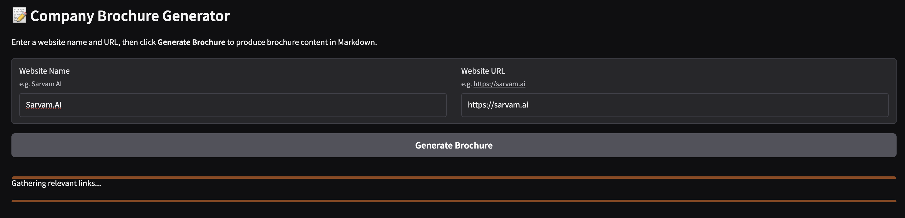
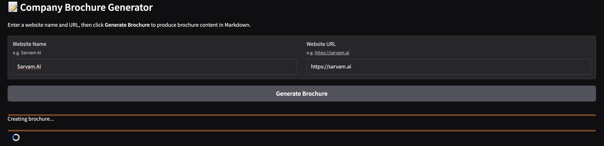
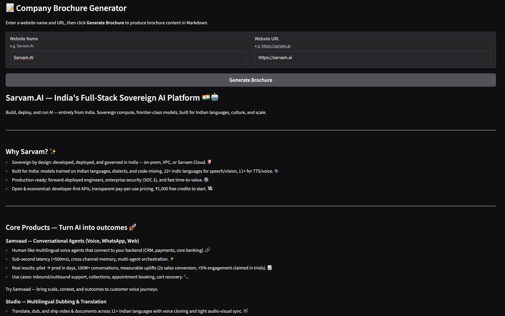

# Company Sales Brochure Generator AI

Builds a short brochure for a company using its website content.

## Tools & Technologies

- LiteLLM with OpenAI models
- Gradio
- BeautifulSoup

## Flow

- Scrape the main website and collect all anchor links.
- Use an LLM to filter and select relevant pages for a brochure (About, Products, Careers, etc.).
- Scrape text content from the relevant pages.
- Combine the content into a single context prompt.
- Generate a brochure in Markdown format using the OpenAI API.

## Steps & Demo

1. Capture input from user: website name and primary URL



2. On clicking generate, a progress feedback UI is shown

2.1. Scrape the main website and collect all anchor links

2.2. LLM Call 1: To filter out relevant links (which are scraped) from the primary url of the company



2.3. Scrape text content from the relevant pages

2.4. LLM Call 2: Generate brochure based on the scraped content



3. Brochure is generated



## Files

- The notebook `brochure-generator-experimentation.ipynb` demonstrates an end-to-end workflow
- A gradio UI was built using:
  - `app.py` - Gradio UI
  - `website_scraper.py` - Scrape website content
  - `llm_engine.py` - LLM engine (to filter relavant links and generate brochure)
  - `utils.py` - Utility functions

## Setup

1. Create and activate a Python virtual environment.

2. Install dependencies:

```bash
pip install openai python-dotenv requests beautifulsoup4 tiktoken ipython gradio
```

3. Add your OpenAI key to a `.env` file in this folder:

```env
OPENAI_TUTORIALS_API_KEY=sk-...
```

4. Open and run the notebook:

- `brochure-generator-experimentation.ipynb`

5. Run the Gradio UI:

```bash
python app.py
```
